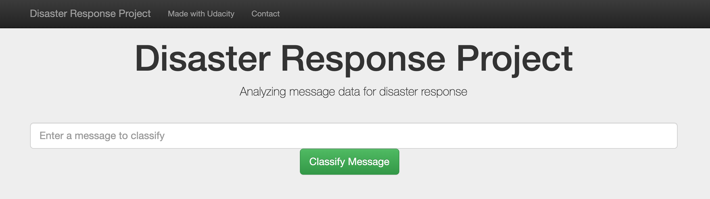
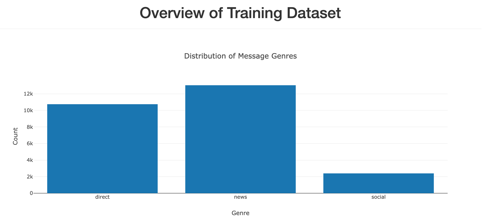
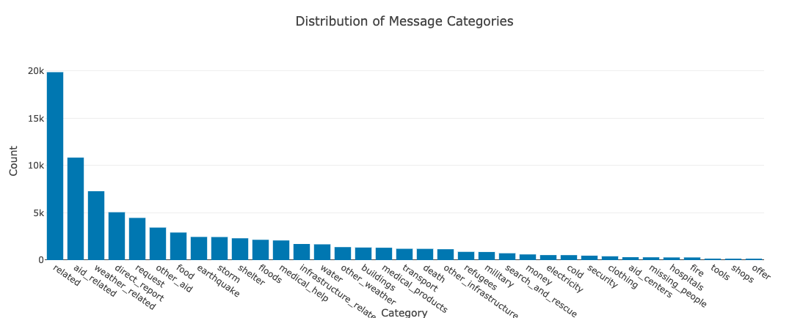
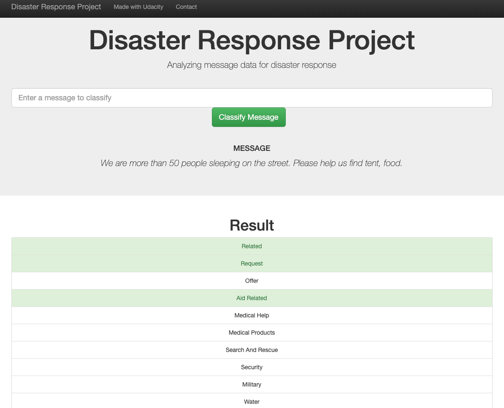

# disaster_response_pipeline
DSND Term 2 Project: Disaster Response Pipeline

## Project Overview
Build a Natural Language Processing (NLP) model that classifies messages during disaster event (e.g. an earthquake or hurricane). The model is capable of classifying messages into several categories so that the messages can be directed to the appropriate aid agencies to act.


## Table of Contents
1. [File Description](#description)
2. [Instructions](#instruction)
	1. [Dependencies](#dependencies)
	2. [Executing Program](#execution)
	3. [Additional Materials](#material)
3. [Acknowledgement](#acknowledgement)
4. [Result](#result)


## File Descriptions
<a name="description"></a>
```
.
├── README.md
├── app
│   ├── run.py
│   └── templates
│       ├── go.html
│       └── master.html
├── data
│   ├── DisasterResponse.db
│   ├── disaster_categories.csv
│   ├── disaster_messages.csv
│   └── process_data.py
├── models
│   ├── disaster_response_prediction.pkl
│   └── train_classifier.py
└── notebook
    ├── ETL Pipeline Preparation.ipynb
    └── ML Pipeline Preparation.ipynb
```

1. ETL Pipeline Data cleaning pipeline contained in data/process_data.py:
    - Loads the messages and categories datasets
    - Merges the two datasets
    - Cleans the data
    - Stores it in a SQLite database

2. ML Pipeline Machine learning pipeline contained in model/train_classifier.py:
    - Loads data from the SQLite database
    - Splits the dataset into training and test sets
    - Builds a text processing and machine learning pipeline
    - Trains and tunes a model using GridSearchCV
    - Outputs results on the test set
    - Exports the final model as a pickle file

3. Flask Web App is the web application to classify messages into respective categories. The web app also displays visualizations of the data.

<a name="instruction"></a>
## Instructions

<a name="dependencies"></a>
### Dependencies
* Python 3.6+
* Machine Learning Libraries: NumPy, SciPy, Pandas, Sciki-Learn
* Natural Language Process Libraries: NLTK
* SQLlite Database Libraqries: SQLalchemy
* Model Loading and Saving Library: Joblib
* Web App and Data Visualization: Flask, Plotly

<a name="execution"></a>
### Executing Program:
1. Execute the following commands in the project's directory to set up the database, train model and save the model.

    - Run ETL pipeline to clean data and store the processed data in the database.
          `python data/process_data.py data/disaster_messages.csv data/disaster_categories.csv data/ DisasterResponse.db`

    - Run the ML pipeline that loads data from DB, trains classifier and saves the classifier as a pickle file.
          `python models/train_classifier.py data/DisasterResponse.db models/disaster_response_prediction.pkl`

    - Run the following command in the app's directory to run your web app.
          `python run.py`

2. Go to http://0.0.0.0:3001/

<a name="material"></a>
### Additional Materials

In the **notebooks** folder you can find two jupyter notebook that demonstrated how the model is built step by step:
1. **ETL Preparation Notebook**: ETL pipeline implementation
2. **ML Pipeline Preparation Notebook**: Machine Learning Pipeline developed with NLTK and Scikit-Learn

<a name="acknowledgement"></a>
## Acknowledgements
Credit to [Figure Eight](https://www.figure-eight.com/) for the message data.

<a name="result"></a>
## Result

1. Main page, include message input box and two overview charts for whole data set.





2. Input the message text and click **Classify Message**, we see the categories the message belongs to highlighted in green.


